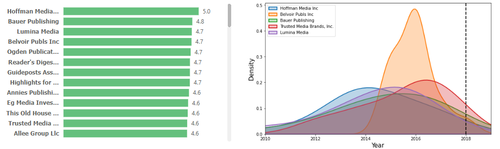
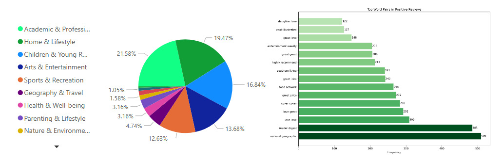

## Project Overview
This project aims to enhance sales performance by intelligently determine popular items, utilizing Natural Language Processing (NLP) techniques and data analysis. By analyzing customer reviews, item rankings, and user search behavior, the system promotes products that demonstrate strong social proof—thereby increasing user engagement and click rates. The analysis is based on Amazon review data spanning 2010 to 2018, sourced from: https://jmcauley.ucsd.edu/data/amazon_v2/index.html.

 

  

## Why Are Reviews and Rankings Important?
In e-commerce, reviews and rankings function as social proof. When a product receives a high number of positive reviews and favorable ratings, it means customers like it. Showcasing popular items prominently can improve user trust and increase the likelihood of interaction and sales.

## The Problems I Attempt to Solve
How do we increase user engagement and boost click-through rates by promoting relevant and popular products.

Before answering it, it could be divided into smaller questions:
- What are the most popular items?
- What kinds of products do users like?
- How can the platform act on these insights from results?

## Identifying Popular Items
- Collect item reviews and ranking data from the e-commerce platform  
- Classify reviews as positive, neutral, or negative using an NLP model  
- Calculate a composite popularity score by combining sentiment and rating  
- Determine rank by incorporating review velocity  

 

  

## Identify Popular Topics and Keywords  
Relevant – Keywords, Topic  
- Filter top 30% popular items based on a composite score combining sentiment and rankings  
- Summarize top performing topics from these items using NLP to identify what users commonly like  
- Extract frequent keywords from reviews to align with user search behavior  

 

  

## User E-commerce Journey
- Enter the site and interact with a search bar enhanced by popular keywords and themes  
- View top-ranking items on the first results page, prioritized by reviews and NLP sentiment-driven scores  
- Engage with relevant products throughout the search process, increasing time on site, click-through rate, and ultimately, sales performance  
